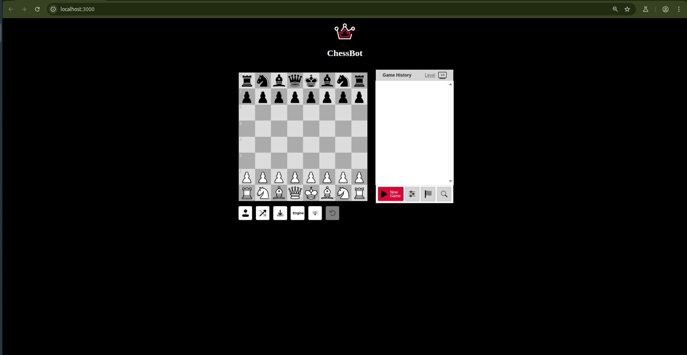
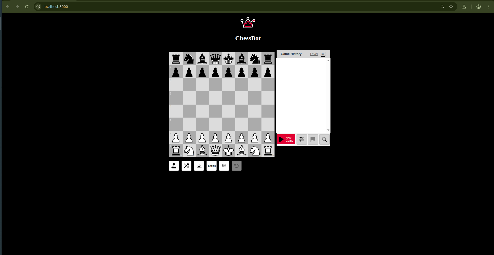
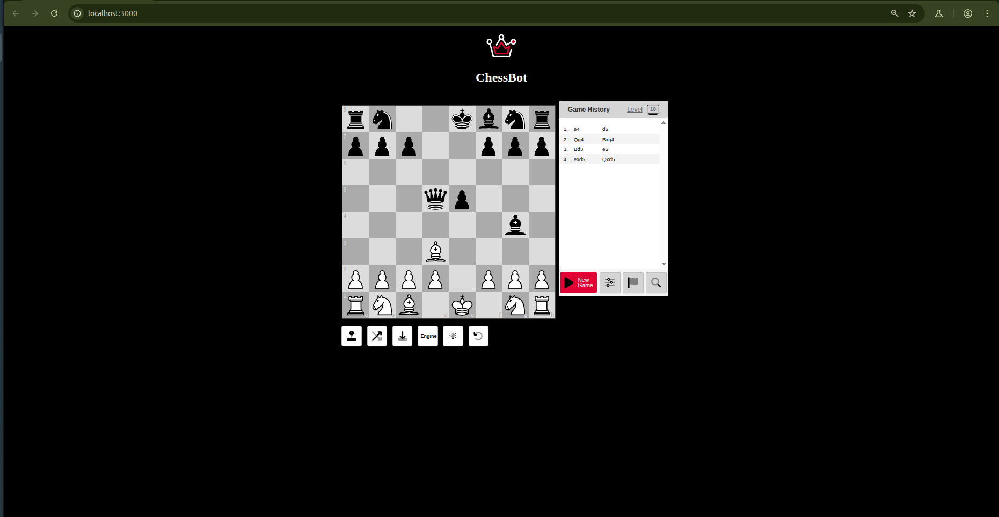
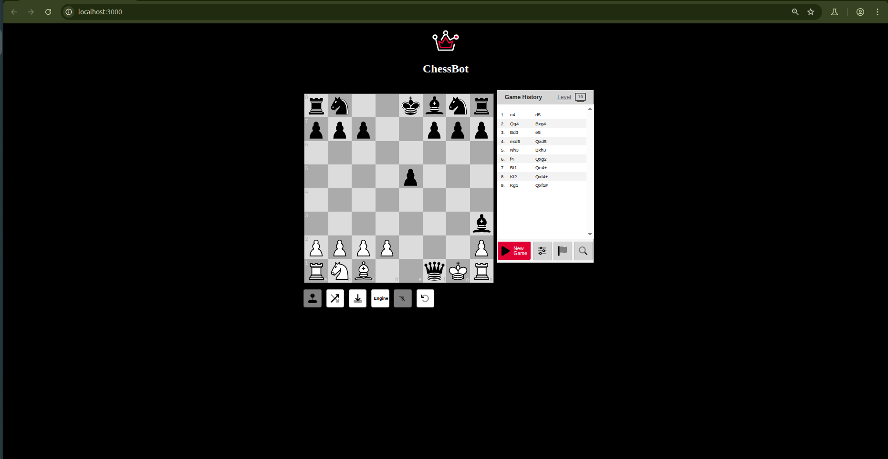

# ♟️ ChessBot AI

An AI-powered chess bot built with Minimax and Alpha-Beta pruning. This project includes a React frontend and a Python backend.

## 🚀 Features

- Intelligent opponent using Minimax with Alpha-Beta pruning
- React-based modern UI
- Adjustable difficulty levels
- Post-match analysis
- Lightweight and responsive

## 📸 Screenshots

### 🖼️ Game Interface








> Place your screenshot image files inside a folder called `screenshots/` in your repo.

## 🛠️ Installation

```bash
# Clone the repo
git clone https://github.com/Ncvamshi/chessbot.git
cd chessbot

# Install frontend & backend dependencies
npm install       # or yarn for frontend
pip install -r requirements.txt  # for Python backend
